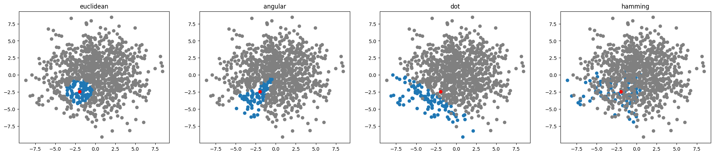

# Vector-Similarity-Using-Spotify-ANNOY
Simple implementation of a NNS (nearest-neighbor-search) system. Used for vector database queries, recommendation systems at Spotify, or knowledge databases of LLMs

